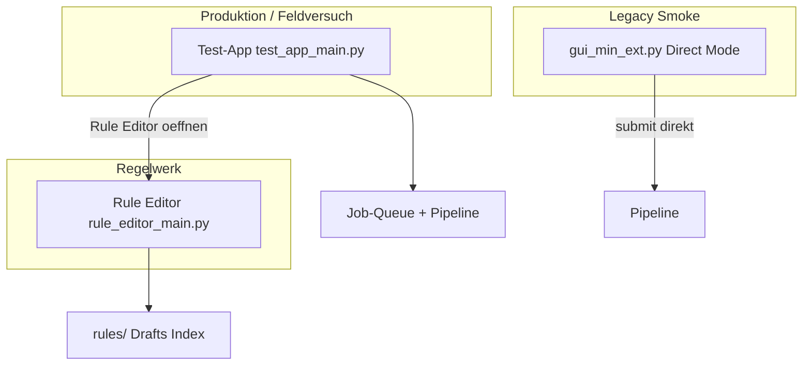

# GUI-Nutzerfunktionen — vollständiges Inventar (AREV2)

Dieses Dokument listet **alle interaktiven Funktionen**, mit denen ein Nutzer über die GUI etwas bewirkt.  
**Produktions-GUI:** [`test_app_main.py`](test_app_main.py) → [`interfaces/tk/test_app.py`](interfaces/tk/test_app.py)  
**Regelwerk-GUI:** [`rule_editor_main.py`](rule_editor_main.py) → [`rule_editor/`](rule_editor/)  
**Legacy (Smoke/Direct):** [`gui_min_ext.py`](gui_min_ext.py)

---

## Übersicht: Drei GUI-Oberflächen

| GUI | Zielgruppe | Kernaufgabe |
|-----|------------|-------------|
| **Test-App** | Labor / Feldversuch | PDFs sammeln, Queue verarbeiten, Nacharbeit, Duplikate, DB-Ansicht |
| **Rule Editor** | Regelwerk-Pflege | Assays definieren, Regex, Drafts, Aktivierung |
| **gui_min_ext** | Entwickler/Smoke | Direkter Pipeline-Submit ohne Queue (veraltet für Distribution) |

---

## A. Test-App (AREV2 Test-App) — 7 Tabs

### Global (immer sichtbar)

| Funktion | Was der Nutzer bewirkt |
|----------|------------------------|
| **Tab wechseln** (EXTRACTOR, OPTIONS, …) | Wechselt Arbeitsbereich |
| **Statuszeile** | Zeigt letzte Meldung und groben Zustand (`idle` / `running`) |
| **Fortschrittsbalken** | Zeigt an, dass Hintergrundarbeit läuft (Extraktion) |
| **Fenster schließen** | Beendet App; stoppt Auto-Suche |

---

### Tab EXTRACTOR — PDFs finden und verarbeiten

**Ziel:** PDFs in die Arbeitsliste bringen und die Extraktions-Queue abarbeiten.

| Funktion | Was der Nutzer bewirkt |
|----------|------------------------|
| **Ergebnisse suchen** | Scannt den Watch-Ordner (OPTIONS), findet neue PDFs, legt Jobs in die Queue (`Wartet`) |
| **Dateien hinzufügen** | Wählt PDFs per Dateidialog und stellt sie in die Queue |
| **Unterordner einbeziehen** (Checkbox) | Scan durchsucht auch Unterordner (mit Ausschlüssen für `processed`, `failed`, …) |
| **Extraktion starten** | Verarbeitet alle wartenden Jobs nacheinander (Parser → Extract → Excel/SQLite) |
| **Extraktion stoppen** | Stoppt nach dem aktuell laufenden Job |
| **Erneut starten** | Setzt **ausgewählte fehlgeschlagene** Zeilen in der Tabelle zurück auf `Wartet` |
| **Aktualisieren** | Lädt Queue-Status neu in die Ergebnis-Tabelle (und ADMIN-Tab) |
| **Automatische Suche starten** | Periodischer In-App-Scan des Watch-Ordners; neue stabile PDFs werden automatisch zur Queue hinzugefügt |
| **Automatische Suche stoppen** | Beendet periodischen Scan |
| **Ergebnis-Tabelle** (Sortieren per Spaltenkopf) | Übersicht: Datei, Herkunft, Status, Gerät, Fehler, Verarbeitung, Pfad, Job-ID |
| **Status Auto-Suche** (3 Labels) | Zeigt aktiv/inaktiv, letzten Scan, Anzahl neuer/beobachteter PDFs |

**Hinweis für Aufräumen:** Zeilenauswahl in der Tabelle hat **keinen** Detail-Handler — nur für **Erneut starten** relevant. `Watch-Modus` in OPTIONS steuert die Auto-Suche **nicht** direkt.

---

### Tab OPTIONS — Laufzeit-Konfiguration

**Ziel:** Einstellungen für Extraktion, Pfade und Gerät.

| Funktion | Was der Nutzer bewirkt |
|----------|------------------------|
| **Output-Modus** | `excel` / `sqlite` / `both` — wohin Ergebnisse geschrieben werden |
| **SQLite-Pfad** | Zieldatei für SQLite-Ergebnisse (auch für DATENBANK/DUPLIKATE) |
| **Watch-Ordner** | Ordner für manuelle/automatische PDF-Suche |
| **Ordner** | Ordnerdialog für Watch-Ordner |
| **Gerät** | Analyzer-Profil (`device_id`) für extrahierte Läufe |
| **Geräte neu laden** | Aktualisiert Geräteliste aus `config/devices.json` |
| **Watch-Modus** | Nur Anzeige/Summary (`Manuell`, `Ueberwachter Ordner`, `Automatikbetrieb`) — **kein direkter Schalt-Mechanismus** |
| **Anzeigen** | Aktualisiert read-only Zusammenfassung unter dem Formular |

**Hinweis für Aufräumen:** Watch-Modus wirkt verwirrend, weil er nicht mit Auto-Suche verknüpft ist.

---

### Tab RULE SUITE — Nacharbeit fehlgeschlagener Jobs

**Ziel:** Fehlgeschlagene Extraktionen analysieren und Regelwerk reparieren.

| Funktion | Was der Nutzer bewirkt |
|----------|------------------------|
| **Nacharbeit aktualisieren** | Lädt fehlgeschlagene Jobs mit Nacharbeit-Kontext (Dump-Pfad, Fehlerursache) |
| **Filter** | Filtert Nacharbeit-Liste: Alle / Assay nicht erkannt / Regelset unvollständig / Aufteilung fehlgeschlagen |
| **Nacharbeit-Tabelle** (Auswahl + Sortieren) | Zeigt Datei, Fehler, Status, Job-ID, Kontext-Pfad |
| **Kontext anzeigen** | Zeigt Detail + normalisierten Dump-Text des ausgewählten Jobs |
| **Rule Editor öffnen** | Startet Rule Editor (externes Fenster/Prozess) |
| **Erneut starten** | Wiederholt ausgewählte fehlgeschlagene Jobs |
| **Rules validieren** | Prüft Integrität aller aktiven Regelwerke (`rules/index.json`) |
| **Assay-Kandidaten prüfen** | Bei Fehler „Assay nicht erkannt“: erkennt mögliche Assay-Keys im Dump |
| **Draft aus Kandidat erstellen** | Erzeugt Regelwerk-Draft aus erkanntem Kandidaten |
| **Kandidaten-Tabelle** | Zeigt Assay-Key, Name, Datei, Zeile, Status, Confidence, Grund |
| **Validierungs-Label** | Ergebnis der Rules-Validierung (OK/FEHLER) |

---

### Tab LOGS

| Funktion | Was der Nutzer bewirkt |
|----------|------------------------|
| **Log-Textfeld** | Zeigt chronologisches Protokoll aller Aktionen (scrollbar; Nutzer kann Text markieren/kopieren) |

---

### Tab DUPLIKATE — SQLite-Dubletten prüfen

**Ziel:** Manuell entscheiden, ob ein erneuter Lauf verworfen wird.

| Funktion | Was der Nutzer bewirkt |
|----------|------------------------|
| **Status** | Filter `pending` / `deleted` |
| **Aktualisieren** | Lädt Duplikat-Kandidaten aus SQLite |
| **Duplikat-Tabelle** (Auswahl) | ID, Status, Assay, Gerät, Erkannt am, bestehender Run, Dedupe-Key |
| **Kandidat verwerfen** | Markiert ausgewählten **pending** Kandidaten als verworfen |
| **Feldvergleich-Tabelle** | Zeigt Feld-für-Feld-Vergleich Kandidat vs. bestehender Run |
| **Detail-Text** | Vollständige technische Duplikat-Informationen |

---

### Tab DATENBANK — gespeicherte Ergebnisse ansehen

**Ziel:** Excel-artige Übersicht über abgelegte Läufe (read-only).

| Funktion | Was der Nutzer bewirkt |
|----------|------------------------|
| **Datenbank laden** | Prüft SQLite-Datei, füllt Assay-Auswahl (lesbare Namen) |
| **Assay** | Wählt Assay (intern per Key, sichtbar als Name) |
| **CHARGE** | Optional: Filter auf Lot/Charge |
| **Einträge anzeigen** | Lädt bis zu 500 Läufe als breite Tabelle |
| **Ergebnis-Tabelle** (Sortieren) | Kernspalten: Datum, Assay-Name, CHARGE, Gerät, PDF; weitere per Spaltenauswahl |
| **Spalten ein-/ausblenden…** | Dialog: Payload-Felder und Meta-Spalten aktivieren |
| **Detail-Text** | Technische Rohdetails zum ausgewählten Lauf (Run-ID, Dedupe-Key, Payload, …) |
| **Status-Label** | DB-Status, Schema-Warnungen, Anzahl/T truncation |

---

### Tab ADMIN — technische Queue-Ansicht

**Ziel:** Rohdaten der Job-Queue einsehen (Support/Debug).

| Funktion | Was der Nutzer bewirkt |
|----------|------------------------|
| **Queue aktualisieren** | Gleiche Aktion wie EXTRACTOR **Aktualisieren** |
| **Queue-Tabelle** (Sortieren) | Job-ID, Datei, Status, Quelle, Versuche, Fehler, Zeitstempel, Pfad — **nur Ansicht** |

---

## B. Rule Editor — Regelwerk visuell pflegen

### Global

| Funktion | Was der Nutzer bewirkt |
|----------|------------------------|
| **Projektordner** + **Ordner…** | Setzt ARE-Projektroot |
| **Assays neu laden** | Lädt Index/Assay-Liste neu |
| **Step by Step** | Geführter Assistent durch Regelwerk-Anlage |
| **Schnellnavigation 1–6** | Springt zu Draft / PDF / Felder / Meta / Validierung / Log |
| **6 Haupt-Tabs** | Wechselt Regelwerk-Arbeitsschritt |

---

### Tab Draft — Drafts & Inventar

| Funktion | Was der Nutzer bewirkt |
|----------|------------------------|
| **Assay (aktiv)** + **Draft aus aktivem Assay** | Kopiert aktives Regelwerk in neuen Draft |
| **Draft laden…** / **Draft laden in Editor** | Öffnet bestehenden Draft |
| **Neuer Assay-Key/Name** + **Neues Draft mit Headern** | Leeres Regelwerk aus Template |
| **Regelwerk als Basis verwenden…** | Klont von aktivem Regelwerk (Dialog) |
| **Neues Regelset (geführt)…** | 5-Schritte-Wizard für neues Assay |
| **Inventar-Tabelle** + **Filter** | Alle / Aktiv / Drafts / Inaktiv |
| **Ansehen/Bearbeiten** | Öffnet ausgewähltes Regelwerk im Editor |
| **Inaktivieren…** | Entfernt aktives Regelwerk aus Index → `rules/inactive/` |
| **Löschen…** | Verschiebt Draft/Inaktiv nach `rules/trash/` |
| **Felder aus Regelwerk übernehmen** | Kopiert Felddefinitionen aus aktivem Assay in aktuellen Draft |
| **Kontextmenü** (Rechtsklick Inventar) | Inaktivieren / Basis / Öffnen / Löschen je nach Typ |

---

### Tab PDF / Assay-Text — Text & Markierungen

| Funktion | Was der Nutzer bewirkt |
|----------|------------------------|
| **Test-PDF** + **PDF…** + **Text laden** | Zeigt extrahierten Assay-Block aus PDF |
| **Markierungs-Ansicht** ein/aus | Side-Panel mit Regex-Treffern |
| **Markierungen:** Aktualisieren / Alle an/aus / Nur Treffer / Nur aktives Feld | Steuert visuelle Overlays |
| **Textauswahl → Regex aus Auswahl / Baustein / Suche ab…** | Baut Feld-Regex aus PDF-Text |
| **Feld bearbeiten** (inline) | Feldname, Regex, Pflicht, search_from, testen, duplizieren, löschen |

---

### Tab Felder — Feldliste verwalten

| Funktion | Was der Nutzer bewirkt |
|----------|------------------------|
| **Felder-Tabelle** | Liste aller Extract-Felder |
| **Feld hinzufügen / übernehmen / duplizieren / entfernen / umbenennen** | CRUD auf Feldern |
| **↑ / ↓** | Reihenfolge der Felder |
| **Regex testen / Bibliothek / Batch-Check** | Validierung gegen geladenen PDF-Text |
| **Im PDF-Tab zeigen** | Springt zu Markierung des Feldes |
| **Regex-Ergebnisse** | Historie der Tests |

---

### Tab Meta & Excel — Export-Metadaten

| Funktion | Was der Nutzer bewirkt |
|----------|------------------------|
| **Assay-Name, Lot-Regex, Dedupe-Felder** | Metadaten für Extraktion/Dedupe |
| **Excel-Dateiname / Sheetname** | Templates für Excel-Ausgabe |
| **column_mapping** | Zuordnung Feld → Excel-Spaltenname |

---

### Tab Validierung & Aktivierung — Draft abschließen

| Funktion | Was der Nutzer bewirkt |
|----------|------------------------|
| **Undo / Redo** (Ctrl+Z/Y) | Macht Draft-Änderungen rückgängig |
| **Draft speichern** | Persistiert Draft |
| **Draft validieren** | Struktur-/Regex-Checks |
| **Preview (extract)** | Test-Extraktion gegen PDF (ohne Produktiv-Write) |
| **Diff anzeigen** | Vergleich Draft vs. aktives Regelwerk |
| **Aktivieren** | Promoted Draft → produktives Regelwerk in `rules/` + Index |
| **Auto-Save (45s)** | Periodisches Speichern |

---

### Dialoge (Rule Editor)

| Dialog | Was der Nutzer bewirkt |
|--------|------------------------|
| **Step-by-Step Guide** | Geführte Tour |
| **Regelwerk als Basis** (Clone) | Neues Draft von Vorlage |
| **Neues Regelset (Wizard)** | Assay-Key, PDF, Pflichtfelder, Kandidaten, Abschluss |
| **Regex-Bibliothek** | Vordefinierte Regex-Snippets einfügen |
| **Regex-Baustein** | Visueller Regex-Builder |

---

## C. Legacy GUI (`gui_min_ext.py`) — Direct Mode

**Nicht** Packaging-Entry; für Entwickler/Smoke. Viele Funktionen **überlappen** mit Test-App + Rule Editor, aber ohne Queue-First.

| Bereich | Funktion | Was der Nutzer bewirkt |
|---------|----------|------------------------|
| Global | Projektroot, Output-Modus, SQLite, Gerät | Konfiguration für direkten `submit()` |
| Single PDF | PDFs wählen, E2E starten, Force rerun | Pipeline direkt auf PDF(s) |
| Batch | Batch E2E, Jobs/Output leeren | Massentest / Admin-Cleanup |
| Rule Preview | Draft erstellen, Regex setzen, Preview, Aktivieren | Minimaler Rulesuite-Test |
| Rules Check | Integrität prüfen | Wie Test-App „Rules validieren“ |
| Duplikate | wie Test-App DUPLIKATE-Tab | Gleiche Duplikat-Review |

---

## D. Aufräum-Potenzial (für UX-Redesign)

### Doppelte / parallele Funktionen

| Nutzerintention | Vorkommen | Empfehlung |
|-----------------|-----------|------------|
| Queue aktualisieren | EXTRACTOR **Aktualisieren** + ADMIN **Queue aktualisieren** | Ein Owner, ein Button |
| Erneut starten | EXTRACTOR + RULE SUITE | Label/Kontext klar trennen oder zusammenführen |
| Rules validieren | RULE SUITE + Legacy Rules Check | Nur Test-App behalten |
| Duplikate verwalten | Test-App + Legacy | Legacy ausblenden/entfernen |
| Rule Editor öffnen | RULE SUITE | OK als Hand-off |
| Regelwerk anlegen | Rule Editor Wizard vs. RULE SUITE Draft aus Kandidat | Zwei Wege — ggf. einen Hauptweg |

### Tot / irreführend

- **Watch-Modus** (OPTIONS): keine Wirkung auf Auto-Suche
- **start_selected_files()** im Code: kein Button
- **LOGS-Textfeld**: editierbar, Änderungen gehen verloren
- **ADMIN-Tab**: rein technisch, für Endnutzer verwirrend

### Nutzer-Journey (empfohlene Hauptpfade)

1. **Normal:** OPTIONS → EXTRACTOR (suchen/hinzufügen) → Extraktion starten → DATENBANK/DUPLIKATE
2. **Fehler:** RULE SUITE → Kontext → Rule Editor → Erneut starten
3. **Regelwerk pflegen:** Rule Editor (eigenständig)

---

## Nächster Schritt (optional)

Wenn du die GUI aufräumen willst, empfehle ich als Folgepaket:

1. **IA-Entwurf:** Tabs auf 4–5 Nutzerziele reduzieren (z. B. Arbeitsliste, Ergebnisse, Regelwerk, Einstellungen)
2. **Entfernen/Verstecken:** ADMIN + Legacy-Overlap + Watch-Modus irreführend
3. **Einheitliche Labels:** Deutsch, gleiche Verben (Laden/Aktualisieren/Starten)
4. **Nutzer-Dokumentation:** [`docs/AP14_TEST_APP.md`](docs/AP14_TEST_APP.md) an neue IA anpassen

Keine Code-Änderung in diesem Schritt — nur Inventar.
