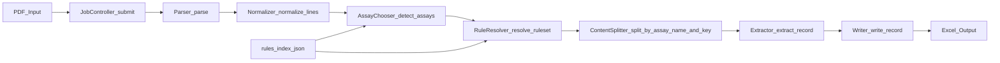

# Projektuebernahme und Betriebsfaehigkeit

Dieses Dokument ist die operative Uebernahmebasis fuer die Projektleitung von `AnalyzerResultExtractorV2`.
Es konsolidiert den **technischen Ist-Vertrag**, den **priorisierten Risiko-Backlog**, die **Go-Live-Mindestkriterien** und einen **umsetzbaren Fahrplan**.

## 1) Ist-Architektur und Vertragsstand (Single Source of Truth)

### 1.1 Produktionsfluss (Ist)

Quelle der realen Orchestrierung: `src/jobcontroller/jobcontroller.py`.

### 1.2 Verbindliche Modulvertraege (Ist-Code)

- `src/jobcontroller/api.py`
  - `submit(pdf_path, project_root) -> JobResult`
  - Job-ID: `sha256(file_bytes)[:16]`
  - Lock: `locks/<job_id>.lock`, State: `jobs/<job_id>.json`
- `src/parser/api.py`
  - `parse(pdf_path) -> ParsedDocument`
  - positionsbasiert, deterministisch, keine Normalisierung
- `src/normalizer/api.py`
  - `normalize_lines(lines) -> list[str]`
  - reduziert Intra-Line-Whitespace, erhaelt Zeilenzahl
- `src/assaychooser/api.py`
  - `detect_assays(norm_text, rules_index_path) -> list[AssayMatch]`
  - case-sensitive `contains` auf `assay_key` aus `rules/index.json`
- `src/ruleresolver/api.py`
  - `resolve_ruleset(assay_key, rules_dir, rules_index_path) -> RuleSet`
  - validiert Regeln (`lot_rule`, `extract_rules`, `excel_rules`)
- `src/contentsplitter/api.py`
  - produktiver Pfad: `split_by_assay_name_and_key(norm_text, assays)`
  - Legacy-APIs vorhanden, aber deprecated
- `src/extractor/api.py`
  - `extract_record(assay_text, ruleset) -> AssayRecord`
  - erzwingt `lot_id`, `test`, `date`, `time`, baut `dedupe_key`
- `src/writer/api.py`
  - `write_record(record, ruleset, output_dir) -> WriteResult`
  - pro Assay eine Datei, pro Lot ein Sheet, dedupe via `dedupe_key`

### 1.3 Laufzeitartefakte (betrieblich relevant)

- `jobs/<job_id>.json`: Persistenter Job-Zustand (`LOCKED`, `PARSED`, `NORMALIZED`, `ASSAYS_DETECTED`, `SPLIT`, `DONE` oder `FAILED`)
- `jobs/<job_id>_normalized.txt`: Volltext nach Normalizer
- `jobs/<job_id>_<assay>_block.txt`: Inputs fuer Extractor pro Assay
- `output/final/*.xlsx`: Ergebnisdateien
- `output/final/.excel_writer.lock`: globaler Writer-Lock

### 1.4 Dokumentationsabweichungen, die als Projektvertrag gelten muessen

Folgende Punkte sind im Code bereits real, aber in Teilen der Dokumentation noch nicht konsistent:

1. `ContentSplitter` ist produktiv in der Pipeline, obwohl fruehe Phase-Dokus ihn nicht als Kernmodul fuehren.
2. Assay-Erkennung erfolgt ueber `assay_key` (nicht primar ueber `assay_name`).
3. Job-State-Maschine enthaelt `NORMALIZED` und `SPLIT`; dokumentierte alte States (`EXTRACTED`, `WRITTEN`) sind im Code nicht als Status vorhanden.
4. Phasen 5-7 sind implementiert, aber formal nicht mit ACCEPTED-Handoff dokumentiert.

---

## 2) Priorisierter Risiko-Backlog (P0/P1/P2)

### 2.1 P0 - Muss vor produktiv stabilem Betrieb adressiert werden

1. **Legacy-Rekursionsfehler in `contentsplitter`-API**
   - Ort: `src/contentsplitter/api.py`
   - Problem: `split_by_assay_keys()` ruft sich selbst rekursiv auf.
   - Auswirkung: Legacy-Aufrufer oder Tests koennen in `RecursionError` laufen.
   - Prioritaet: P0 (direkter Funktionsbruch).

2. **Regelindex nicht vollstaendig konsistent mit vorhandenen Rulesets**
   - Ort: `rules/index.json` vs `rules/*.json`
   - Problem: existierende Rulesets koennen unregistriert sein und damit nie erkannt werden.
   - Auswirkung: Assays werden nicht verarbeitet, fachliche Daten fehlen.
   - Prioritaet: P0 (Silent Functional Gap).

3. **Extractor-Vertrag hart auf `test|date|time` gekoppelt**
   - Ort: `src/extractor/extractor.py`
   - Problem: Dedupe-Pflichtfelder sind hardcoded und koennen mit Rule-Templates kollidieren.
   - Auswirkung: ExtractionError trotz sonst valider Daten.
   - Prioritaet: P0 (Run-Abbruch in produktiver Verarbeitung).

4. **Kritischer Pipelinepfad ohne E2E-Absicherung**
   - Ort: `tests/` deckt Parser, RuleResolver, Extractor, Writer, JobController nicht ab.
   - Auswirkung: Regressionsrisiko hoch, Freigaben nicht belastbar.
   - Prioritaet: P0 (betriebliches Risiko).

### 2.2 P1 - Stabilitaet und Betriebssicherheit

1. **Stale-Lock-Recovery nicht implementiert**
   - Ort: `src/jobcontroller/jobcontroller.py` (Locking nur create-exclusive)
   - Auswirkung: haengende Jobs/Prozesse koennen Folgejobs blockieren.

2. **Breite Exception-Behandlung ohne Fehlerklassifikation**
   - Ort: `JobController.submit()` globale `except Exception`
   - Auswirkung: eingeschraenkte Root-Cause-Analyse im Betrieb.

3. **Dokumentation hinter Ist-Code**
   - Ort: `DOCUMENTATION/` (insbesondere Phase 5-7)
   - Auswirkung: Onboarding, Wartung und Freigabeentscheidungen werden fehleranfaellig.

### 2.3 P2 - Wartbarkeit und Skalierbarkeit

1. **Packaging/Projekt-Hygiene**
   - Kein `pyproject.toml`, keine saubere Repo-Hygiene fuer Build-Artefakte und Cache-Dateien.
2. **Konfigurierbarkeit**
   - Dedupe-Policy und teilweise Feldkonventionen sind nicht vollstaendig regelbasiert.
3. **Observability light**
   - Kein standardisiertes Runbook/Monitoring-Flow fuer Regelpflege, Fehlerklassen, Recovery.

---

## 3) Go-Live-Mindestkriterien (betriebsfaehig vs. nicht betriebsfaehig)

Ein Release gilt erst dann als **betriebsfaehig**, wenn alle Punkte in Abschnitt A/B/C erfuellt sind.

### A) Funktionale Mindestkriterien

- A1: Einzelfall-PDF laeuft End-to-End auf `DONE` und schreibt korrektes Excel.
- A2: Mehrfach-Assay-PDF laeuft End-to-End auf `DONE`, getrennte Blocks stimmen pro Assay.
- A3: Alle in `rules/` produktiv genutzten Rulesets sind in `rules/index.json` registriert.
- A4: Extrahierte Pflichtfelder (`lot_id`, `test`, `date`, `time`) sind je Assay nachweisbar.
- A5: Dedupe verhindert Duplikatzeilen reproduzierbar ueber mehrere identische Runs.

### B) Zuverlaessigkeit und Recovery

- B1: Locking-Fehlerbild ist bekannt, dokumentiert, und Recovery-Prozess ist vorhanden.
- B2: Fehlgeschlagene Jobs landen deterministisch in `FAILED` inkl. aussagekraeftiger Fehlermeldung.
- B3: Debug-Dumps (`_normalized`, `_block`) sind fuer Incident-Analyse verfuegbar.

### C) Qualitaetsnachweise (Minimum)

- C1: Unit-Tests fuer `RuleResolver`, produktiven `ContentSplitter`-Pfad, `Extractor`, `Writer`.
- C2: Mindestens ein Smoke-E2E-Test ueber `JobController.submit(...)`.
- C3: Testdaten (mindestens 1 Single + 1 Multi-Assay PDF oder stabile Text-Fixtures) sind versioniert/verfuegbar.
- C4: Freigabecheckliste dokumentiert: "gruen" nur bei bestandenen Pflichttests.

### Nachweisprotokoll (Release Gate)

Pro Release wird eine kurze Freigabedatei erstellt mit:
- Commit/Build-Referenz
- Ergebnis A1-A5, B1-B3, C1-C4 (pass/fail)
- bekannte Restrisiken mit Owner und Termin

---

## 4) Umsetzungsfahrplan in Wellen

### Welle A - Stabilisierung (P0 zuerst)

Ziel: Produktiven Pfad deterministisch und fehlerfrei betreiben.

Arbeitspakete:
1. `contentsplitter/api.py` Legacy-Rekursionsfehler beheben oder Legacy-API sauber stilllegen.
2. `rules/index.json` gegen `rules/*.json` automatisch validieren (Konsistenz-Check).
3. Extractor-Regelvertrag absichern (Pflichtfelder klar dokumentieren, Template angleichen).
4. Dokumentierte Incident-Workarounds fuer Locking und Rule-Fehler bereitstellen.

Abnahmekriterien:
- Kein reproduzierbarer P0-Bug offen.
- Kernpipeline fuer bekannte Testfaelle laeuft durch.

### Welle B - Qualitaetsausbau

Ziel: Regressionssicherheit fuer Betrieb und Weiterentwicklung.

Arbeitspakete:
1. Unit-Tests:
   - `ruleresolver`: unknown key, missing section, mismatch
   - `contentsplitter`: `split_by_assay_name_and_key`, edge cases
   - `extractor`: required-field failures, search_from cases
   - `writer`: created/appended/skipped + header evolution
2. Smoke-E2E-Test ueber `JobController` mit stabilen Fixtures.
3. Optional: einfache Quality-Gates (lokaler Test-Runner, standardisierter Release-Befehl).

Abnahmekriterien:
- Pflichttestset gruen und reproduzierbar.
- Kritische Fehler werden vor Merge erkannt.

### Welle C - Betriebsreife und Fuehrungsfaehigkeit

Ziel: Teamfaehiger, auditierbarer Regelbetrieb.

Arbeitspakete:
1. Dokumentation auf Ist-Vertrag bringen (Phase 5-7 + ContentSplitter + Statusmodell).
2. Betriebsrunbook:
   - Rule-Onboarding
   - Lock/Job-Recovery
   - Fehlerklassifikation und Eskalation
3. Packaging/Distribution standardisieren (EXE-Prozess, Ablagestruktur, Release-Routine).

Abnahmekriterien:
- Neues Teammitglied kann mit Doku + Runbook ohne implizites Wissen betreiben.
- Freigaben laufen ueber klaren, wiederholbaren Prozess.

---

## 5) Verantwortungsmodell fuer Projektleitung (ab sofort)

- **Technischer Vertragseigner:** Pipeline-Vertraege in `src/*/api.py` + `jobcontroller.py`
- **Regelwerkseigner:** `rules/index.json` und `rules/*.json` inkl. Konsistenz
- **Qualitaetseigner:** Pflichttestset + Release-Gates
- **Betriebseigner:** Job/Lock/Output-Prozesse, Incident-Recovery, Runbook

Diese Verantwortlichkeiten sind die operative Grundlage fuer die naechste Planungs- und Umsetzungsrunde.
