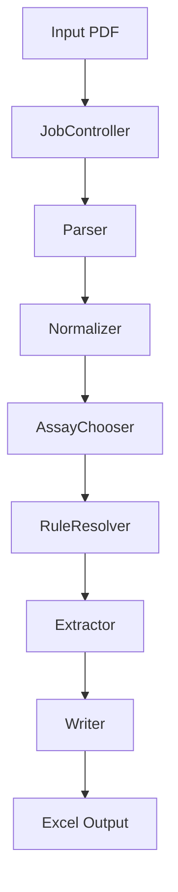
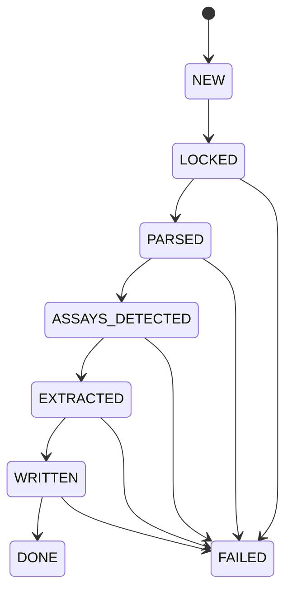

# DevGuide – PDF Ergebnis-Extractor (verbindlich)

> **Zweck:** Verbindlicher Entwicklungsleitfaden für menschliche Entwickler und KI-Agenten.  
> Dieses Dokument ist die **globale Verfassung** des Projekts.  
> Alles Nicht-Geschriebene gilt als **nicht garantiert**.

---

## 1. Rolle dieses Dokuments (wichtig)

Dieser Dev Guide ist das **oberste Regelwerk** des Projekts.

- Er gilt **für alle Phasen**
- Er wird **nicht** pro Phase kopiert oder überschrieben
- Working Agreements und KI-Handoffs **referenzieren** diesen Guide, sie ersetzen ihn nicht

Wenn es einen Konflikt gibt:
**Dev Guide > Working Agreement > Implementierung**

---

## 2. Kernprinzipien (bindend)

- Contract-First
- Phase-Isolation
- Single Responsibility Principle (SRP)
- Deterministisches Verhalten
- Serielle, crash-sichere Verarbeitung
- Zero-Guess-Policy (keine impliziten Annahmen)

---

## 3. Systemziel

- Input: PDF-Dateien (ein oder mehrere Assays pro PDF)
- Output:
  - pro Assay **eine Excel-Datei**
  - pro Lot **ein Sheet**
  - pro Analysenlauf **eine Zeile**
- Wiederholtes Verarbeiten identischer Inhalte darf **keine Duplikate** erzeugen

---

## 4. Gesamtarchitektur



Alle Module kommunizieren **ausschließlich** über ihre `api.py`.

---

## 5. Modulübersicht (finale Namen)

| Modul | Pfad | Verantwortung |
|------|------|---------------|
| JobController | src/jobcontroller | Orchestrierung, State, Recovery |
| Parser | src/parser | Positional PDF-Extraktion |
| Normalizer | src/normalizer | Whitespace-Normalisierung |
| AssayChooser | src/assaychooser | Assay-Erkennung |
| RuleResolver | src/ruleresolver | RuleSet-Laden & Validieren |
| Extractor | src/extractor | Fachliche Extraktion |
| Writer | src/writer | Excel-Write + Dedupe |

---

## 6. ZENTRALE REGEL: Stable API Facade (kritisch)

### 6.1 Grundregel

`src/<module>/api.py` ist eine **stabile Fassade**.

Sie wird **nicht** angepasst, wenn sich interne Implementierungsdetails ändern.

### 6.2 `api.py` DARF enthalten

- Öffentliche Datentypen (Contracts)
- Öffentliche Funktionssignaturen
- Docstrings mit garantierter Semantik
- **Exakt eine Delegation pro Funktion** auf eine interne Implementierung

### 6.3 `api.py` DARF NICHT enthalten

- Schleifen
- Daten-Transformationen
- IO
- Fachlogik
- Meta-Berechnungen
- Kontrollfluss (if/for), außer explizit als Contract definiert

### 6.4 Interne Implementierung

- Liegt in internen Modulen (`_impl.py`, `_service.py`, `_positional.py`)
- Darf sich ändern, ohne dass `api.py` geändert wird
- Ist **nicht** Teil des öffentlichen Vertrags

### 6.5 Contract-Änderungen

`api.py` darf **nur** geändert werden, wenn sich der öffentliche Vertrag ändert:

- Signaturen
- Datentypen
- garantierte Semantik
- Fehlerverhalten

Jede Contract-Änderung erfordert:
- Anpassung des Working Agreements
- neues Handoff / Revision

---

## 7. JobController – Orchestrierung & State



- Job-ID = Hash(PDF-Dateiinhalt)
- DONE + gleiche Job-ID → Skip
- Recovery über zeitbasierten stale-lock (Windows)

---

## 8. Fachliche Pipeline (Kurzfassung)

1. Parser: positional, line-based
2. Normalizer: optional, whitespace-only
3. AssayChooser: contains(assay_name)
4. RuleResolver: index.json → RuleSet
5. Extractor: genau eine RunRow pro Assay
6. Writer: append-only + dedupe_key

---

## 9. Excel-Strategie (bindend)

- Pro Assay eine Datei
- Pro Lot ein Sheet
- Eine Zeile pro Analysenlauf
- Dedupe-Key: `test|YYYY-MM-DD|HH:MM:SS`
- Append-only + idempotent

---

## 10. Projektstruktur (bindend)

```text
project-root/
├── src/
│   ├── jobcontroller/
│   ├── parser/
│   ├── normalizer/
│   ├── assaychooser/
│   ├── ruleresolver/
│   ├── extractor/
│   └── writer/
├── rules/
├── input/
├── output/
├── jobs/
├── locks/
└── tests/
```

---

## 11. Entwicklungsregeln

- Keine Logik in `api.py`
- Keine Querverwendung interner Module
- Tests nutzen nur öffentliche APIs
- Keine stillen Contract-Änderungen

---

## 12. Typische Fehler, die dieses Regelwerk verhindert

- Endlose API-Diskussionen
- Doppelte Änderungen bei Refactorings
- Implizite Annahmen zwischen Phasen
- „Das war doch klar“-Implementierungen

---

## 13. Gültigkeit

Dieses Dokument ist gültig, bis es **explizit revidiert** wird.

---

> **Leitregel:**  
> Wenn eine Entscheidung nicht hier oder in einem formalen Phase-Handoff dokumentiert ist, darf sie nicht angenommen werden.