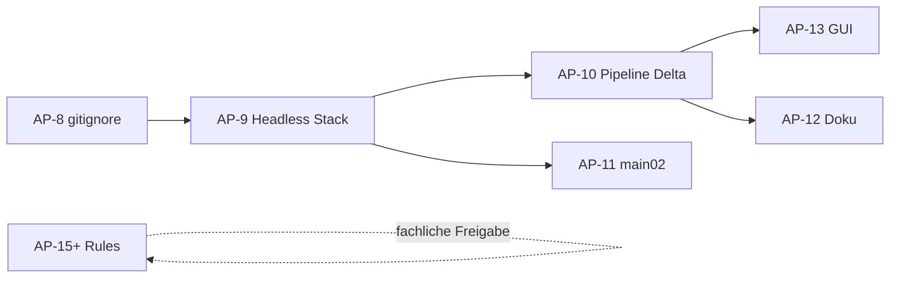

# AP-7: Working-Tree-Triage

**Datum:** 2026-07-10
**Basis-Commit:** `2b968a7` (AP-6.1: RuleSuite CLI/API Authoring-Readiness absichern)
**Scope:** Analyse + Commit-Vorschläge — keine Änderungen am Working Tree in AP-7.

## Kurzfazit

Der Working Tree ist nach AP-6.1 weiterhin stark dirty: **18 geänderte tracked Dateien** (+1294 / −1286 Zeilen) plus ein großer Block **untracked produktiver Quellen** (Headless-Runtime, Queue, SQLite, CLI-Adapter, Tests). Die Änderungen lassen sich in sieben Gruppen trennen. Gruppe **G** (neue Module) ist Voraussetzung für Gruppe **B** (Pipeline-Delta). Gruppe **A** (Rules) erfordert fachliche Freigabe pro Assay. Als nächster sicherer Schritt empfiehlt sich **AP-8** (eng gefasste `.gitignore`-Erweiterung) oder direkt **AP-9** (Headless-Runtime-Stack).

---

## Inventar (zusammengefasst)

| Kennzahl | Wert |
|---|---|
| Modified (tracked) | 18 Dateien |
| Diff-Umfang | +1294 / −1286 Zeilen |
| Untracked (produktiv, geschätzt) | ~45 Quell-/Test-/Doku-Dateien |
| Untracked (Artefakte/Noise) | tausende (`__pycache__`, `build/`, `dist/`, `packaging/build_work/`, …) |
| `.gitignore` heute | nur `rules/drafts/` |
| Staged | nichts |

### Modified tracked — nach Gruppe

| Gruppe | Dateien | Δ Zeilen (ca.) |
|---|---|---|
| A Rules | 6 × `rules/*.json`, `rules/index.json` | ~760 |
| B Pipeline | 9 × `src/{extractor,jobcontroller,ruleresolver,contentsplitter}/*` | ~320 |
| C GUI | `gui_min.py`, `gui_min_ext.py` | ~1280 (v. a. Reformat/Refactor) |
| D Entry | `main02.py` | ~100 |
| E Doku | `README.md` | +115 |

### Untracked — grobe Buckets

| Bucket | Beispiele | Anzahl (ca.) |
|---|---|---|
| Neue `src/`-Pakete | `runtime/`, `jobqueue/`, `dbwriter/`, `watchdog/`, `testui/` | 14 `.py` |
| CLI/Headless-Adapter | `interfaces/cli/{e2e,rules_matrix,rules_validate}.py`, `interfaces/headless/` | 6 `.py` |
| Root-Entrypoints | `watchdog_main.py`, `worker_main.py`, `rules_matrix_main.py`, `rules_validate_main.py` | 4 |
| Tests | `tests/test_architecture_gates.py`, `test_dbwriter.py`, … | 16 |
| `docs/` (operativ) | `ARCHITECTURE.md`, `TESTBASELINE.md`, … | 7 |
| `DOCUMENTATION/` (Legacy) | Phase-0–7 Handoff-Docs | 14 |
| Packaging-Quelle | `packaging/build_onedir.py` | 1 (+ generierte Artefakte darunter) |
| Agent-Guide | `AGENTS.md` | 1 |
| Ruleresolver-Ergänzung | `src/ruleresolver/validator.py` | 1 |

---

## Gruppen A–G

### A — Rules-Facharbeit / Alt-Diffs

| Datei | Änderung (Kern) |
|---|---|
| `rules/25-OH Vitamin D.json` | `column_mapping` Umbau (Alt-Keys → Header-Felder); Regex bereits in AP-5 committed |
| `rules/Anti-Centromeres IgG.json` | Großes Reformat (~361 Zeilen), vermutlich Struktur/`dedupe_fields` |
| `rules/Anti-dsDNA-NcX IgG.json` | Reformat + strukturelle Bereinigung |
| `rules/Anti-Nucleosomes IgG.json` | 3 Zeilen: Legacy-`column_mapping`-Keys entfernt |
| `rules/Rheumatoid Factor IgA.json` | 3 Zeilen: Legacy-`column_mapping`-Keys entfernt |
| `rules/index.json` | Neuer Eintrag `(661f)` → Anti-dsDNA-NcX |

- **Zweck:** Fachliche Rules-Pflege und Index-Ergänzung; teils Alt-Diffs aus früheren Sessions.
- **Risiko:** **hoch** (Matrix/Preview-abhängig, fachliche Entscheidungen).
- **Empfehlung:** **vorher fachlich entscheiden**; pro Assay **separat committen**; nie mit Pipeline/GUI mischen.
- **Gates:** `rules_validate_main.py`, `rules_matrix_main.py --mode preview`

---

### B — Standalone-/Pipeline-/AREV2-Code

| Datei | Änderung (Kern) |
|---|---|
| `src/extractor/extractor.py` | `dedupe_fields`-Policy, robustere `search_from`, kein hardcoded test/date/time-Dedupe |
| `src/extractor/api.py` | `ExtractionError` export, `__all__` |
| `src/jobcontroller/jobcontroller.py` | Dual-Output, Runtime-Locks, Validation-Gate, SQLite-Retries |
| `src/jobcontroller/api.py` | Erweiterte `submit()`-Signatur (`output_mode`, SQLite-Optionen) |
| `src/jobcontroller/model.py` | Kleine Anpassung |
| `src/ruleresolver/ruleresolver.py` | Erweiterungen (+77 Zeilen) |
| `src/ruleresolver/api.py` | `validate_rules_integrity` in Public API |
| `src/contentsplitter/api.py` | Bugfix rekursiver `split_by_assay_keys`, `AssayDescriptor`-Export |

- **Zweck:** Headless-Pipeline, Dedupe-Policy, Dual-Output, Rules-Integritätsprüfung.
- **Risiko:** **mittel–hoch** — hängt von Gruppe G ab (`runtime`, `dbwriter`, `validator`).
- **Empfehlung:** **nicht vor Gruppe G committen**; danach als **ein Pipeline-Paket** mit zugehörigen Tests.
- **Gates:** `pytest -q`, `rules_validate_main.py`, `rules_matrix_main.py --mode preview`

---

### C — GUI/Tkinter-Provisorium

| Datei | Änderung (Kern) |
|---|---|
| `gui_min.py` | Thin-Wrapper (~10 Zeilen) → delegiert an `gui_min_ext` |
| `gui_min_ext.py` | Große Überarbeitung; nutzt `src.jobcontroller.api`, `src.runtime.api`, `src.testui.api`, `src.rulesuite.api` |

- **Zweck:** Test-UI für Direktmodus; Runtime-Config, Job-Outcome-Formatierung.
- **Risiko:** **mittel** (UI-Verhalten, Startup-Smoke).
- **Empfehlung:** **separat committen**, nach Pipeline+Runtime; **keine GUI-Politur** im nächsten Schritt.
- **Gates:** `pytest -q`, optional `$env:ARE_SMOKE_EXIT="1"; python gui_min.py`

---

### D — Entry-/Runtime-/Wrapper

| Status | Datei | Änderung (Kern) |
|---|---|---|
| M | `main02.py` | Delegiert nur noch an `interfaces.cli.e2e.main` (3 Zeilen) |
| ?? | `watchdog_main.py`, `worker_main.py` | Thin-Wrapper → `interfaces.headless` |
| ?? | `rules_matrix_main.py`, `rules_validate_main.py` | Thin-Wrapper → `interfaces.cli` |
| ?? | `interfaces/cli/e2e.py` | E2E-Diagnose-CLI |
| ?? | `interfaces/cli/rules_matrix.py` | Rule-Matrix preview/e2e |
| ?? | `interfaces/cli/rules_validate.py` | Rules-Integrität CLI |
| ?? | `interfaces/headless/watchdog.py`, `worker.py` | Headless-Prozesse |

- **Zweck:** Standalone-Entrypoints gemäß AGENTS.md; Root-Wrapper delegieren in Adapter-Schicht.
- **Risiko:** **niedrig–mittel** (dünn, aber Runtime-Abhängigkeit).
- **Empfehlung:** Untracked-Teile **mit Gruppe G committen**; `main02.py` im gleichen oder Folge-Paket.
- **Gates:** `$env:ARE_WATCHDOG_ONCE="1"; python watchdog_main.py`, `$env:ARE_WORKER_ONCE="1"; python worker_main.py`, `python main02.py`

---

### E — Doku/README

| Status | Datei | Inhalt (Kern) |
|---|---|---|
| M | `README.md` | Headless-Betrieb, Output-Modi, Rule Suite, Matrix, Architektur (+115 Zeilen) |
| ?? | `docs/ARCHITECTURE.md` | Modulgrenzen, Pipeline-Flow |
| ?? | `docs/TESTBASELINE.md` | Reproduzierbare Verifikation |
| ?? | `docs/DEDUPE_POLICY.md` | `dedupe_key`-Vertrag |
| ?? | `docs/KNOWN_ISSUES.md` | Risiko-Register Testphase |
| ?? | `docs/EMBEDDING.md` | Public API für Embedding |
| ?? | `docs/QMTOOLV7_STRUCTURE_COMPARISON_MATRIX.md` | Ist-vs-QMToolV7 (Analyse) |
| ?? | `docs/RESTRUCTURE_PLAN_EXTERNAL.md` | Externer Restrukturierungsplan (nur Planung) |
| ?? | `AGENTS.md` | Agent-Guide, Architekturgrenzen, Gates |

**Separat — Legacy-/Handoff-Doku (nicht Artefakt):**

| Status | Pfad | Hinweis |
|---|---|---|
| ?? | `DOCUMENTATION/` (14 Dateien) | Phase-0–7 KI-Handoff-Docs; **untracked Legacy-Doku, separat zu entscheiden** ob committen, archivieren oder belassen |

- **Zweck:** Betriebsdoku und Architekturreferenz für Standalone/Headless-Phase.
- **Risiko:** **niedrig** (Review-only); `RESTRUCTURE_PLAN_EXTERNAL.md` nicht als Implementationsgrundlage.
- **Empfehlung:** `docs/*` + `AGENTS.md` + `README.md` **nach Code-Paketen separat committen**; `DOCUMENTATION/` erst nach expliziter Entscheidung.
- **Gates:** keine (Review)

---

### F — Artefakte / lokaler Noise

**Sichere `.gitignore`-Kandidaten** (nur echte lokale Artefakte/Caches):

```
__pycache__/
*.pyc
.pytest_cache/
.idea/
.vscode/
build/
dist/
output/
jobs/
*.egg-info/
```

Zusätzlich unter `packaging/` (generiert, nicht committen): `build_work/`, `dist_output/`

**Separat erwähnen — nicht automatisch ignorieren:**

| Datei | Hinweis |
|---|---|
| `AnalyzerResultExtractorV2.zip` | Build-Artefakt; ggf. manuell löschen oder außerhalb Repo ablegen |
| `AnalyzerResultExtractorV2.spec` | PyInstaller-Spec; prüfen ob bewusst versioniert werden soll |
| `packaging/build_onedir.py` | **produktive Quelle** (Gruppe G), nicht ignorieren |

- **Zweck:** Laufzeit-/Build-/IDE-Artefakte verdecken produktive Diffs.
- **Risiko:** **niedrig**.
- **Empfehlung:** **AP-8: `.gitignore` eng erweitern** — eigenes kleines Paket vor großen Code-Commits.
- **Gates:** `git status --short` sollte danach deutlich kürzer sein.

---

### G — Untracked produktive Quellen/Tests

| Bereich | Dateien |
|---|---|
| `src/runtime/` | `api.py`, `config.py`, `file_lock.py`, `paths.py` |
| `src/jobqueue/` | `api.py`, `queue.py`, `model.py` |
| `src/dbwriter/` | `api.py`, `dbwriter.py`, `model.py` |
| `src/watchdog/` | `api.py`, `service.py` |
| `src/testui/` | `api.py`, `helpers.py`, `__init__.py` |
| `src/ruleresolver/validator.py` | Rules-Integritätsprüfung (von `api.py` referenziert) |
| `packaging/build_onedir.py` | PyInstaller onedir Build |
| Tests (16) | siehe Tabelle unten |

| Test | Zielmodul |
|---|---|
| `test_architecture_gates.py` | Adapter importieren nur `src.*.api` |
| `test_runtime_paths.py`, `test_file_lock.py` | `src.runtime` |
| `test_jobqueue.py` | `src.jobqueue` |
| `test_dbwriter.py` | `src.dbwriter` |
| `test_watchdog.py` | `src.watchdog` |
| `test_worker_status_mapping.py` | `interfaces.headless.worker` |
| `test_jobcontroller_dual_output.py`, `test_jobcontroller_locks.py` | `src.jobcontroller` |
| `test_extractor.py` | `src.extractor` |
| `test_ruleresolver.py` | `src.ruleresolver` |
| `test_contentsplitter_production.py` | `src.contentsplitter` |
| `test_parser.py` | `src.parser` |
| `test_writer.py` | `src.writer` |
| `test_rules_matrix.py` | `interfaces.cli.rules_matrix` |
| `test_testui_helpers.py` | `src.testui` |

- **Zweck:** Kohärenter Headless-Stack (Watchdog → Queue → Worker → Pipeline → Excel/SQLite).
- **Risiko:** **mittel** (groß, aber zusammenhängend).
- **Empfehlung:** **als nächstes sicheres Commit-Paket** nach AP-8; mit Gruppe B+D testen.
- **Gates:** `pytest -q`, Watchdog/Worker once, optional `packaging/build_onedir.py`

---

## Architekturgrenzen (AGENTS.md, read-only)

| Prüfpunkt | Ergebnis |
|---|---|
| Adapter (`main02.py`, `gui_min*.py`) importieren nur `src.*.api` | **konform** |
| `src/jobcontroller` → `src.runtime.api`, `src.dbwriter.api` | **konform**, Module noch untracked |
| `src/extractor` → `src.ruleresolver.api.RuleSet` | **konform** |
| `src/ruleresolver/api.py` → internes `.validator` | **konform**; `validator.py` muss mit committed werden |
| PyQt/QMTool-Scope in offenen Diffs | **nicht vorhanden** |
| Standalone-Entrypoints relevant | **ja** — untracked `*_main.py` + modified `main02.py` |

**Abhängigkeit:** Gruppe B allein ist **nicht commit-fähig** ohne Gruppe G (`runtime`, `dbwriter`, `validator`).

Validierung durch untracked `tests/test_architecture_gates.py` (Root-Wrapper ≤15 Zeilen, Adapter nur `src.*.api`).

---

## Vorgeschlagene Commit-Reihenfolge

| # | Paket | Kern-Dateien | Voraussetzung |
|---|---|---|---|
| 1 | **AP-8: `.gitignore` eng erweitern** | `.gitignore` (nur sichere Artefakt-Muster, siehe Gruppe F) | keine |
| 2 | **AP-9: Headless-Runtime-Stack** | Gruppe G + D (untracked) + `validator.py` | AP-8 optional |
| 3 | **AP-10: Pipeline-Delta** | Gruppe B (9 `src/*`) | AP-9 |
| 4 | **AP-11: Entry-Delegation** | `main02.py` | AP-9 |
| 5 | **AP-12: Betriebsdoku** | `README.md`, `AGENTS.md`, `docs/{ARCHITECTURE,TESTBASELINE,DEDUPE_POLICY,KNOWN_ISSUES,EMBEDDING}.md` | AP-9/10 |
| 6 | **AP-13: Test-UI Tkinter** | `gui_min.py`, `gui_min_ext.py` | AP-9/10 |
| 7 | **AP-14: Legacy-Handoff-Doku** | `DOCUMENTATION/*` — **nur nach expliziter Freigabe** | Entscheidung |
| 8 | **AP-15+:** Rules pro Assay | Gruppe A, je Assay isoliert | **fachliche Freigabe** |

**Empfohlener nächster AP:** **AP-8** (`.gitignore`, minimales Risiko, sofort steuerbarer Tree) oder direkt **AP-9** (Headless-Stack, größter kohärenter Block).

---

## Nicht anfassen ohne Freigabe

- `rules/*.json`, `rules/index.json`, `rules/template.json`
- Fachliche Regex-/Mapping-Entscheidungen in Gruppe A
- `gui_min_ext.py` UX-Politur
- `docs/RESTRUCTURE_PLAN_EXTERNAL.md` als Implementationsgrundlage
- `DOCUMENTATION/` — Commit/Archiv erst nach separater Entscheidung

---

## Artefakt-/Ignore-Kandidaten

Siehe Gruppe F. Nur die eng definierten Muster automatisch ignorieren. ZIP/Spec separat behandeln.

---

## Abhängigkeiten (Übersicht)



---

*Erstellt in AP-7. Kein Commit. Working Tree unverändert bis auf diese Datei.*
