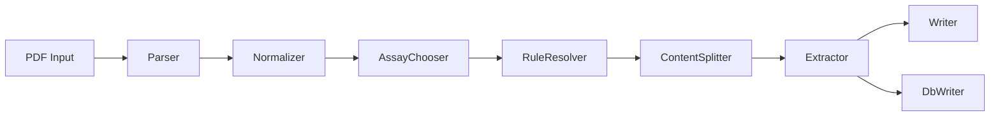

# AREV2 Architecture

## Ziel

AnalyzerResultExtractorV2 bleibt eine eigenstaendige Windows-Anwendung fuer PDF-basierte Analyse-Extraktion. Gleichzeitig stellt das Repo klar abgegrenzte Python-APIs bereit, damit spaetere Konsumenten dieselbe Pipeline ohne Direktimporte in interne Module nutzen koennen.

## Laufzeitbild

- Orchestrator: `src/jobcontroller/api.py`
- Headless Queue: `src/watchdog/api.py` + `src/jobqueue/api.py`
- Rule Authoring: `src/rulesuite/api.py`
- Assay-Kandidaten (read-only): `src/assaycandidate/api.py`
- Runtime/Pfade: `src/runtime/api.py`

## Modulgrenzen

- Oeffentliche Produktionsgrenzen liegen unter `src/<modul>/api.py`.
- Interne Implementierungen (`*.model`, `*.service`, `*.helpers`, `*.queue`, `*.jobcontroller`) bleiben hinter diesen APIs.
- Adapter und UIs importieren fremde `src`-Module nur ueber deren `api.py`.

## Entry Points

### Root-Wrapper

- `test_app_main.py` — produktionsnahe Test-App (Feldversuch, Arbeitsliste-first)
- `watchdog_main.py`
- `worker_main.py`
- `rule_editor_main.py`
- `main02.py`
- `rule_suite_main.py`
- `rules_validate_main.py`

Diese Dateien enthalten nur noch schlanke Delegation auf `interfaces/` bzw. Tk-Adapter.

### Interfaces

- `interfaces/headless/`
  - `watchdog.py`
  - `worker.py`
- `interfaces/cli/`
  - `e2e.py`
  - `rule_suite.py`
  - `rules_validate.py`
- `interfaces/tk/`
  - `test_app.py` — Test-App UI
  - `watch_scan.py` — In-App-Watch-Scan
- `interfaces/common/`
  - `queue_worker.py` — gemeinsame Queue-Verarbeitung fuer Test-App und Headless-Worker

Hier liegt Adapter- und CLI-Orchestrierung, aber keine zusaetzliche Fachlogik.

### GUI

- `test_app_main.py` startet die produktionsnahe Test-App (`interfaces/tk/test_app.py`).
- `rule_editor_main.py` startet den Tkinter-Rule-Editor.
- `gui_min_ext.py` / `gui_min.py` sind **Legacy**-Direktmodus-GUIs fuer `submit` ohne Queue/Arbeitsliste; weiterhin fuer Smoke/Entwicklung, nicht mehr Packaging-Entry.

## Runtime-Vertrag

- `src/runtime/api.py` ist die einzige Runtime-Facade fuer Adapter.
- `resolve_app_root()` beruecksichtigt zuerst `ARE_HOME`, dann PyInstaller (`sys.executable`) und zuletzt den uebergebenen Dateipfad.
- Schreibbare Laufzeitdaten (`jobs/`, `locks/`, `output/`) haengen am aufgeloesten App-Root.

## Packaging

- Kanonischer Build-Pfad: `packaging/build_onedir.py`
- Entry: `test_app_main.py` → portables ZIP unter `packaging/dist_output/AnalyzerResultExtractorV2.zip`
- Legacy-PyInstaller-Spec bleibt nur aus Kompatibilitaetsgruenden im Repo und ist nicht mehr die bevorzugte Build-Quelle.

Feldversuch-Anleitung: `docs/AP17A_FIELD_TRIAL_PACKAGE.md`
