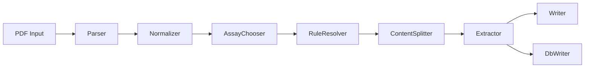
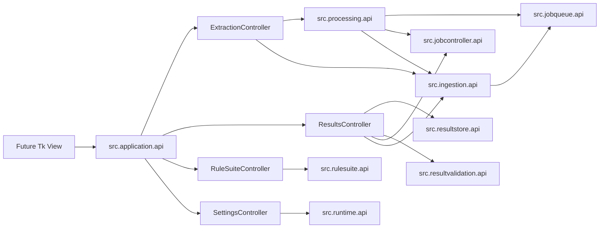

# AREV2 Architecture

## Ziel

AnalyzerResultExtractorV2 bleibt eine eigenstaendige Windows-Anwendung fuer PDF-basierte Analyse-Extraktion. Gleichzeitig stellt das Repo klar abgegrenzte Python-APIs bereit, damit spaetere Konsumenten dieselbe Pipeline ohne Direktimporte in interne Module nutzen koennen.

## Laufzeitbild

- Orchestrator: `src/jobcontroller/api.py`
- Headless Queue: `src/watchdog/api.py` + `src/jobqueue/api.py`
- Processing (Queue/Worker-Orchestrierung): `src/processing/api.py`
- Import-Instanz / Watch-Archiv / Recovery: `src/ingestion/api.py`
- Desktop Use Cases (neue Views): `src/application/api.py`
- Rule Authoring: `src/rulesuite/api.py`
- Assay-Kandidaten (read-only): `src/assaycandidate/api.py`
- Ergebnisvalidation (append-only): `src/resultvalidation/api.py`
- Runtime/Pfade: `src/runtime/api.py`

## Ausgabe, Status und Excel-Retry

Owner bleibt `src/jobcontroller`. Es gibt keinen zweiten Retry-Pfad und keine neue Queue. SQLite, Excel und Archiv sind getrennte Statusschritte:

- Alle Assays werden extrahiert, bevor ein Sink schreibt. Fuer `both` wird der atomare `output_plan` Version 2 bereits **vor** dem ersten SQLite-Side-Effect gespeichert. Jeder Eintrag beginnt mit `structured_status/sqlite_status=pending` und `sqlite_run_id=null`; vor und nach jedem Sink wird der Job-State atomar persistiert. Derselbe vollstaendig identifizierte SQLite-Schreibversuch (`job_id`, PDF-Hash, Block-Hash und Payload) liefert beim Wiederanlauf den echten vorhandenen `run_id` als `already_persisted`, waehrend ein anderer Job weiterhin ein `duplicate_pending` erzeugt.
- Nach erfolgreichem SQLite-Write steht ein normaler `both`-Eintrag auf `excel_status=awaiting_validation`. Der Job und die Queue sind `DONE`; deshalb darf `src/ingestion` die PDF bereits archivieren. Ein Duplikat-Klaerfall bleibt `skipped_duplicate_pending`. `sqlite` setzt Excel auf `not_required`; der Legacy-Modus `excel` schreibt weiterhin unmittelbar.
- `src.resultvalidation` bleibt die einzige Wahrheit fuer die append-only menschliche Validierung. Erst danach gibt `src.jobcontroller` genau den betroffenen `sqlite_run_id` aus dem Frozen Plan fuer Excel frei. Excel erhaelt `VALIDIERT_DURCH` und `VALIDIERT_AM`; eine neuere Korrektur aktualisiert nur diese beiden Zellen. `validation_id` wird monoton in den Plan uebernommen, sodass eine aeltere oder gleichzeitig eintreffende Freigabe keinen neueren Stand ueberschreibt.
- Ein Excel-Fehler nach erfolgreicher Validierung aendert weder Validation noch Queue-/Archivstatus. Der bestehende Diagnose-Retry ist `export_only` und arbeitet nur aus Plan plus aktuell wirksamer Validation; PDF, Parser, Extractor, DBWriter und aktuelle Rules werden nicht erneut verwendet. Auch wenn der Prozess oder Export-Lock zwischen Validation-Commit und Plan-Snapshot ausfaellt, entdeckt der Retry die wirksame Validation ueber `src.resultvalidation.api`, merged sie monoton und setzt den Export fort. Erfolgreiche oder noch unvalidierte Eintraege werden dabei nicht exportiert.
- Workbook-Saves verwenden unter dem gemeinsamen Runtime-Lock ein Same-Directory-Tempfile plus `os.replace`. Job-State-Dateien bleiben ebenfalls atomar. Fehlt bei historischen Jobs ein Plan v2, wird keine zweite Export-Persistenzwahrheit erzeugt.

## Modulgrenzen

- Oeffentliche Produktionsgrenzen liegen unter `src/<modul>/api.py`.
- Interne Implementierungen (`*.model`, `*.service`, `*.helpers`, `*.queue`, `*.jobcontroller`) bleiben hinter diesen APIs.
- Adapter und UIs importieren fremde `src`-Module nur ueber deren `api.py`.

## Entry Points

### Root-Wrapper

- `test_app_main.py` — Produkt-Shell `AnalyzerDesktopApp` (Feldversuch-Default); `LegacyTestApp` via `ARE_LEGACY_UI`
- `watchdog_main.py`
- `worker_main.py`
- `rule_editor_main.py`
- `main02.py`
- `rule_suite_main.py`
- `rules_validate_main.py`

Diese Dateien enthalten nur noch schlanke Delegation auf `interfaces/` bzw. Tk-Adapter.

### Interfaces

- `interfaces/headless/`
  - `watchdog.py`
  - `worker.py`
- `interfaces/cli/`
  - `e2e.py`
  - `rule_suite.py`
  - `rules_validate.py`
- `interfaces/tk/`
  - `test_app.py` — `AnalyzerDesktopApp` (Default) und `LegacyTestApp` (Fallback)
  - `watch_scan.py` — In-App-Watch-Scan
- `interfaces/common/`
  - `queue_worker.py` — duenner Kompatibilitaets-Re-Export auf `src.processing.api`

Hier liegt Adapter- und CLI-Orchestrierung, aber keine zusaetzliche Fachlogik.

## Application / Processing / Ingestion (Phase 1–2)

- `src/application` ist Tk-frei; importiert keine `interfaces/*`-Module und keine internen Fremd-`src`-Implementierungen. Exakt vier Controller-Module/-Klassen und exakt vier `DesktopAppServices`-Felder (`extraction`, `results`, `rules`, `settings`).
- `src/processing` besitzt die Queue-/Worker-Orchestrierung (ein wartender Job, DONE/FAILED/already_done/deferred/Exception-Semantik) und ruft nach terminalem Queue-Status `src.ingestion.api` zur Reconciliation auf.
- `src/ingestion` ist alleiniger Owner fuer Import-Instanz-Ledger (`ingestion_id`), Watch-Scan/Stabilitaet, Archivierung/Recovery und `current_path`. Persistenz: `<project_root>/storage/ingestion/*.json` (atomar, file-backed; corrupt/invalid JSON fail-closed). Archive publish: verified partial → exclusive `os.link` into final target (same volume, no overwrite); unsupported/failed link fails closed with source+partial preserved. Archive-Status inkl. `RECOVERY_REQUIRED` wenn Quelle+Ziel fehlen und kein verifiziertes Partial finalisierbar ist. Keine Writes in `src.resultstore`.
- `SettingsController` persistiert optional `<project_root>/storage/desktop_settings.json` fuer `output_mode`, `sqlite_path`, `watch_enabled`, `watch_input_path`, `watch_backup_path`, `watch_recursive`, `device_id` und `operator_initials` (Legacy-Alias `watch_dir` beim Laden). Initialen werden getrimmt; `watch_enabled` / `watch_recursive` Default `false`. Archiv-Eligibility nur bei Queue-Status `DONE` (nicht `FAILED`).
- Phase 3A: Application-Readmodels/DTOs fuer Ingestion-Instanzen (`IngestionInstanceItem` mit queue-aware `display_status`), Report-Lesen (`ReportSummaryItem`/`ReportDetail` via `src.resultstore.api.list_report_summaries`/`get_report_runs` mit gemeinsamer Owner-Gruppierung: primaer `job_id`, Legacy-Fallback normalisierter `pdf_path` + deterministisches `created_at`-Fenster `LEGACY_REPORT_TIME_WINDOW_S=5.0`), Nacharbeit-Diagnose (`JobDiagnosisItem` via gehaertetem `get_job_evidence` inkl. begrenztem `context_text`/`context_source_label`; Volltext-Discovery via `get_job_diagnostic_sources`), Duplikat-Diagnose (`DuplicateCandidate*`/`DuplicateExistingRunItem`/`DuplicateDecisionResult`), Assay-Kandidaten (`RuleSuiteController.discover_assay_candidates` und `discover_assay_candidates_for_job`), Watch-/Device-Readmodels (`WatchTimingSettings` mit safe Normalisierung `max(0.5, scan)` / stabile Fenster-Regeln, `DeviceInventoryStatus`), zentraler Statusmapping-Vertrag (`presentation.py`), kontrollierte Desktop-Aktionen (`SettingsController.open_output_folder`, `ResultsController.open_report_pdf`; generische `open_path` nicht oeffentlich).
- Phase 3B (Shell): `AnalyzerDesktopApp` in `interfaces/tk/test_app.py` — fuenf Views, `TkTaskRunner` fuer Hintergrund-I/O, Orchestrierung ueber `src.application.api` (vier Controller). Default-Start: `test_app_main.py` → `run_entry` → `main()` → `AnalyzerDesktopApp`; Fallback `LegacyTestApp` via `ARE_LEGACY_UI`. Controller-/Storage-Zugriffe nicht auf dem Tk-Hauptthread; Widgets/Dialoge nur im UI-Thread. Gate 3 ist mit kompletter Suite, Onedir-Build und manuellem Tk-Smoke abgeschlossen.
- `ExtractionController.run_watch_cycle()` ist headless testbar; `interfaces/headless/watchdog.py` delegiert dorthin (kein Event-Watchdog). Stable-Window-Normalisierung entspricht `SettingsController.get_watch_timing()`.
- `ResultsController` loest `current_pdf_path` additiv ueber `src.ingestion.api.resolve_current_path` (Exact-Match; sonst Legacy-Fallback; Mehrdeutigkeit ohne Willkuer-Auswahl). Report-`display_status` priorisiert echte Queue-Status aus `src.jobqueue.api.list_jobs`, sonst Ledger-Status der exakt aufgeloesten `ingestion_id`; `DONE` nur bei leerem `job_id`, `legacy_fallback` und ohne Queue-/Ledger-Evidenz.
- Phase 4: `src.resultvalidation.api` ist alleiniger Owner der Tabelle `run_validations`. Erstvalidation und explizite Korrektur sind append-only; Korrekturen verweisen ueber `supersedes_validation_id` auf den vorherigen Stand. `src.resultstore` bleibt read-only. `ResultsController` reichert Report-DTOs mit aktueller Validation und Historie an und leitet `Unvalidiert`, `Teilweise validiert`, `Validiert` bzw. bei Fehler/Klaerfall `Pruefung erforderlich` ab. Die Tk-View schreibt nie direkt nach SQLite.
- `ProcessingOutcome` bleibt bewusst queue-/extraktionsbezogen (`processed`, `job_id`, `queue_status`, `submit_status`, …). Ein Queue-Job kann mehrere Ingestion-Instanzen bedienen; per-Instanz-`archive_status` / `archive_error` liegen in `ImportRecordItem` und sind ueber `ExtractionController.list_import_records` / `get_import_record` abrufbar — kein singulaeres `ProcessingOutcome`-Feld, um den spaeteren GUI-Statusvertrag ohne DTO-Churn zu erfuellen.

### GUI

- `test_app_main.py` startet die Produkt-Shell (`AnalyzerDesktopApp`); `ARE_LEGACY_UI=1` aktiviert die tabbed Legacy-`TestApp`.
- `run_entry`: `ARE_SMOKE_EXIT=1` → Startup-Check ohne Tk; `ARE_START_RULE_EDITOR=1` → Rule Editor; sonst `main(project_root=resolve_app_root(...))`.
- `rule_editor_main.py` startet den Tkinter-Rule-Editor (auch aus der Rules-Ansicht bzw. per EXE-Neustart im Frozen-Modus). Das Fenster haelt genau einen `RuleSuiteController`. `rule_editor/**/*.py` importiert `src` hoechstens als `src.application.api`; Assay-Auswahl und Manage-Inventar nutzen `list_inventory`. Die Aktivierung eines bestehenden Regelwerks laeuft ueber denselben Controller und damit ueber den byte-genauen, fail-closed History-Snapshot. Die Phase-6-Inventar-Startseite und der dreispaltige Workspace (`field_list_panel`, `report_panel`, `field_settings_panel`) bleiben bestehen; seltene Funktionen liegen in `advanced_view`. Phase 7 erweitert das Inventar additiv um read-only History/Trash mit Zeitstempel, SHA-256 und Fehlerstatus. History und Inactive werden ueber den Controller als neue, nicht ueberschreibende Drafts geoeffnet; Trash bleibt unveraenderlich. Gate 7 ist nach Review, Vollregression und sichtbarer isolierter Lifecycle-Abnahme `GATE_PASSED`.
- `gui_min_ext.py` / `gui_min.py` sind **Legacy**-Direktmodus-GUIs fuer `submit` ohne Queue/Arbeitsliste; weiterhin fuer Smoke/Entwicklung, nicht mehr Packaging-Entry.

## Runtime-Vertrag

- `src/runtime/api.py` ist die einzige Runtime-Facade fuer Adapter.
- `resolve_app_root()` beruecksichtigt zuerst `ARE_HOME`, dann PyInstaller (`sys.executable`) und zuletzt den uebergebenen Dateipfad.
- Schreibbare Laufzeitdaten (`jobs/`, `locks/`, `output/`) haengen am aufgeloesten App-Root.

## Packaging

- Kanonischer Build-Pfad: `packaging/build_onedir.py`
- Entry: `test_app_main.py` → portables ZIP unter `packaging/dist_output/AnalyzerResultExtractorV2.zip`
- Legacy-PyInstaller-Spec bleibt nur aus Kompatibilitaetsgruenden im Repo und ist nicht mehr die bevorzugte Build-Quelle.

Feldversuch-Anleitung: `docs/AP17A_FIELD_TRIAL_PACKAGE.md`
