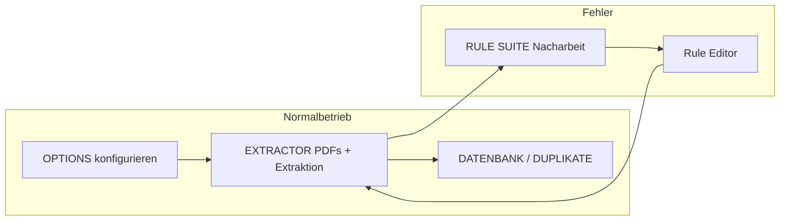

# GUI Informationsarchitektur — Vorschlag

Ziel: Test-App für Labor/Feldversuch **übersichtlicher** machen, ohne Rule Editor oder Pipeline zu ersetzen.

## Nutzer-Journeys

1. **Normal:** Einstellungen → PDFs sammeln → extrahieren → Ergebnisse/ Duplikate prüfen  
2. **Fehler:** Nacharbeit → Kontext → Rule Editor → erneut verarbeiten  
3. **Regelwerk:** Rule Editor eigenständig (Autor)

## Tab-Struktur (Ist → empfohlen)

| Ist | Rolle | Empfehlung |
|-----|-------|------------|
| EXTRACTOR | Arbeitsliste + Verarbeitung | Behalten; Primary Tab beim Start |
| OPTIONS | Konfiguration | Behalten; Watch-Modus entfernt (irreführend) |
| RULE SUITE | Nacharbeit | Behalten; klare Button-Labels |
| LOGS | Protokoll | Behalten; read-only |
| DUPLIKATE | Review | Behalten |
| DATENBANK | Ergebnisansicht | Behalten |
| ADMIN | Debug-Queue | **Standard ausblenden** (`ARE_SHOW_ADMIN=1`) |

Optional später (nicht umgesetzt): Tabs umbenennen z. B. **Arbeitsliste**, **Einstellungen**, **Nacharbeit**, **Ergebnisse**, **Duplikate**.

## Konsolidierte Aktionen (umgesetzt)

| Vorher | Nachher |
|--------|---------|
| Zwei × „Erneut starten“ | **Fehler erneut verarbeiten** (EXTRACTOR) / **Nacharbeit wiederholen** (RULE SUITE) |
| Watch-Modus (ohne Wirkung) | Entfernt aus OPTIONS |
| ADMIN + EXTRACTOR Aktualisieren | ADMIN nur mit Env-Flag |

## Nicht in Test-App duplizieren

- Regelwerk-Authoring (Wizard, Regex, Aktivierung) → Rule Editor  
- Direct submit ohne Queue → Legacy `gui_min_ext.py` only  
- Rules-Matrix E2E → CLI `rules_matrix_main.py`

## Nächste UX-Iteration (optional)

- EXTRACTOR als Start-Tab  
- Gruppierung Buttons: „Sammeln“ | „Verarbeiten“ | „Steuerung“  
- Kontext-Hilfe pro Tab (kurzer Satz unter Überschrift)  
- Duplikate/DATENBANK unter gemeinsamen „Ergebnisse“-Parent (Notebook-Untertabs)
