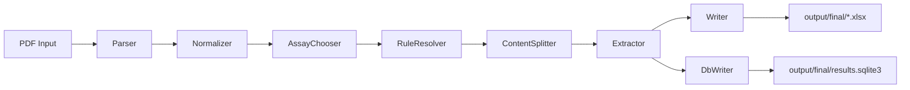
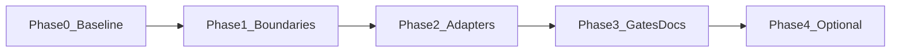

# Externer Umsetzungsplan — AnalyzerResultExtractorV2

| Feld | Wert |
|------|------|
| **Projekt** | AnalyzerResultExtractorV2 (AREV2) |
| **Pfad** | `I:\Projekte\AnalyzerResultExtractorV2` |
| **Benchmark** | QMToolV7 Kanon-Architektur (P0, nur als Vergleichsmaßstab) |
| **Erstellt** | 2026-07-01 |
| **Erstellt von** | QMToolV7-Team / Architektur-Analyse (extern) |
| **Zielgruppe** | Verantwortlicher Dev/Architect für AREV2 |
| **Status** | Planungsgrundlage — **keine Implementierung enthalten** |
| **Begleitdokument** | [`QMTOOLV7_STRUCTURE_COMPARISON_MATRIX.md`](QMTOOLV7_STRUCTURE_COMPARISON_MATRIX.md) |

---

## 1. Einleitung

Dieses Dokument ist die **externe Planungsgrundlage** für eventuelle Umbauten an AnalyzerResultExtractorV2. Es wurde durch einen strukturierten Vergleich mit der QMToolV7-Referenzarchitektur erstellt.

**Kernbotschaft:** QMToolV7 ist Benchmark, kein Kopierziel. AREV2 ist ein Single-User-PDF-Extraktionstool mit Headless-Queue — nicht jedes QM-Muster ist relevant. Die begleitende Matrix listet pro Dimension, was `must_fix`, `should_fix`, `could_fix` oder `N/A` ist.

**Nächster Schritt für dich:** Phase 0 (Baseline) starten, Supervisor-Entscheidungen in Abschnitt 9 einholen, dann Option A/B/C wählen.

---

## 2. Zweck, Zielbild, Non-Goals

### Zweck

- Strukturelle Stärken von AREV2 sichtbar machen (klare Pipeline, `api.py`-Muster, Build-Gates).
- Konkrete Abweichungen mit Dateievidenz dokumentieren.
- Phasierte, risikoarme Umbau-Roadmap bereitstellen.
- Cursor-Agents über Matrix-IDs steuerbar machen.

### Zielbild (nach Umsetzung Option A — Minimal)

- Alle `must_fix`-Zeilen in der Matrix sind `konform` oder bewusst `N/A` dokumentiert.
- Adapter importieren nur Public APIs (`*.api`).
- Automatisierte Architecture-Gates verhindern Regressionen.
- `AGENTS.md` beschreibt Regeln für Menschen und Agents.
- Build und Tests bleiben grün.

### Non-Goals (explizit nicht Teil dieses Plans)

- Kein 1:1-Klon von QMToolV7.
- Kein Multi-User-Backend (`src/backend/`).
- Kein Auth/Rollen/Lizenz-System.
- Kein Domain-Event-Bus / Audit-Log / Correlation-Causation-Stack.
- Keine PyQt-Migration (Tkinter bleibt).
- Keine Umbenennung `src/` → `modules/` ohne separate Supervisor-Entscheidung.
- Keine Big-Bang-Refactorings.

---

## 3. Ist-Zustand (kompakt)

### Pipeline



**Orchestrator:** `src/jobcontroller/jobcontroller.py` (`JobController.submit`)

### Entry Points (Adapter)

| Datei | Rolle | Primäre Imports |
|-------|-------|-----------------|
| `main.py` | Minimaler E2E-Harness | `jobcontroller.api` |
| `main02.py` | Ausführlicher E2E-Harness | `jobcontroller.api` |
| `watchdog_main.py` | Headless Folder-Watcher | `runtime.config`, **`watchdog.service`**, `watchdog.api` |
| `worker_main.py` | Headless Queue-Worker | `jobcontroller.api`, `jobqueue.api`, `runtime.config` |
| `rule_suite_main.py` | CLI Rule-Authoring | `rulesuite.api` |
| `rule_editor_main.py` | Tkinter Rule-Editor | `rule_editor/*` → `rulesuite.api` |
| `rules_validate_main.py` | Rules-Integritäts-Gate | `ruleresolver.api` |
| `gui_min.py` / `gui_min_ext.py` | Test-GUI (PyInstaller-Entry) | mehrere `*.api`, `runtime.*`, `testui.helpers` |

### Storage

| Store | Pfad | Format |
|-------|------|--------|
| Rules | `rules/*.json`, `rules/index.json` | JSON |
| Drafts | `rules/drafts/*.draft.json` | JSON |
| Job-State | `jobs/<job_id>.json` | JSON mit `steps[]` |
| Queue | `jobs/queue/<job_id>.json` | JSON |
| Locks | `locks/`, `jobs/queue_locks/` | File-Locks |
| Excel | `output/final/{assay}.xlsx` | openpyxl |
| SQLite | `output/final/results.sqlite3` (default) | sqlite3, Tabelle `runs` |

### Modul-Inventar

14 Module unter `src/` — Details in Matrix, Anhang A.

---

## 4. Gap-Zusammenfassung (Top-Abweichungen)

Sortiert nach Priorität aus der Matrix:

| Rang | Matrix-ID | Kurzbeschreibung | priority |
|------|-----------|------------------|----------|
| 1 | BOUND-01, BOUND-02 | `AssayDescriptor` direkt aus `contentsplitter.model` | must_fix |
| 2 | BOUND-03 | `QueueJob` direkt aus `jobqueue.model` in Watchdog | must_fix |
| 3 | BOUND-04 | `watchdog_main.py` umgeht `watchdog.api` | must_fix |
| 4 | API-02, BOUND-07 | `runtime/` ohne Public API, direkte Imports | must_fix |
| 5 | ADAPTER-04 | Adapter importieren `runtime.*` direkt | must_fix |
| 6 | TEST-02 | Keine Architecture-Gate-Tests | must_fix |
| 7 | API-04 | Kein `contracts.py`; DTOs über Modulgrenzen | must_fix |
| 8 | LAYOUT-02, ADAPTER-01 | Kein `interfaces/`-Layer | should_fix |
| 9 | BOUND-05 | Tests/Adapter-Grenzen nicht automatisiert | should_fix |
| 10 | PKG-04 | Legacy `.spec` parallel zu `build_onedir.py` | should_fix |

**Bereits konform (nicht anfassen):** Pipeline-Orchestrierung (`SVC-03`), Onedir-Build (`PKG-01`–`PKG-03`), Rules-Validierung (`TEST-04`), Modulbenennung (`NAME-01`).

---

## 5. Zieloptionen (Supervisor-Entscheid nötig)

| Option | Umfang | Aufwand | Nutzen | Empfehlung |
|--------|--------|---------|--------|------------|
| **A — Minimal** | Boundary-Fixes (Phase 1) + Architecture-Gates + `AGENTS.md` (Phase 3) | Gering (~1–2 Tage) | Hoher Schutz, minimaler Bruch | **Zuerst** |
| **B — Strukturell** | A + `interfaces/`-Layer für CLI/Headless/Tk (Phase 2) | Mittel (~3–5 Tage) | QMToolV7-ähnliche Navigierbarkeit | Nach A, wenn gewünscht |
| **C — QM-like** | B + `contracts.py`, Settings-Registry, formalisiertes Trace (Phase 4) | Hoch | Nur bei Integration ins QM-Ökosystem | Nur bei explizitem Bedarf |

**Keine Option ist vorentschieden.** Standardempfehlung: **Option A**, dann Review.

---


## 6. Phasen-Roadmap



### Phase 0 — Baseline (Pflicht vor jeder Änderung)

**Ziel:** Messpunkt dokumentieren.

**Aufgaben:**
1. Diesen Plan und die Matrix lesen und abnehmen.
2. Supervisor-Entscheidungen (Abschnitt 9) klären oder als „offen“ markieren.
3. Baseline ausführen und Ergebnis notieren:
   ```powershell
   cd I:\Projekte\AnalyzerResultExtractorV2
   .\.venv\Scripts\python.exe -m pytest -q
   .\.venv\Scripts\python.exe rules_validate_main.py
   # Optional vollständiger Build:
   .\.venv\Scripts\python.exe packaging\build_onedir.py
   ```

**Akzeptanzkriterien:**
- [x] Baseline-Ergebnis (pass/fail, Testanzahl) in Commit-Notiz oder Ticket dokumentiert
- [x] Option A/B/C vom Supervisor festgelegt oder Default A bestätigt

**Baseline 2026-07-01:** `pytest -q` → **63 passed** in 3.72s; `rules_validate_main.py` → **grün** (alle Integritätslisten leer). Supervisor: **Option A — Minimal**; `src/` bleibt; Architecture-Gates AREV2-angepasst (Phase 3).

---

### Phase 1 — Boundaries (Option A Kern)

**Ziel:** Alle `must_fix`-Boundary-Zeilen adressieren.

**Matrix-IDs:** `API-01`, `API-02`, `API-04`, `BOUND-01`–`BOUND-04`, `BOUND-07`, `ADAPTER-04`

**Vorgeschlagene Arbeitspakete:**

| Paket | Änderung | Betroffene Dateien |
|-------|----------|-------------------|
| 1.1 | `AssayDescriptor` über `contentsplitter/api.py` oder neues `contracts.py` exportieren | `contentsplitter/api.py`, `jobcontroller/jobcontroller.py`, `rulesuite/rulesuite.py` |
| 1.2 | `QueueJob` über `jobqueue/api.py` re-exportieren | `jobqueue/api.py`, `watchdog/service.py`, `watchdog/api.py` |
| 1.3 | `watchdog_main.py` nur noch `watchdog.api` nutzen | `watchdog_main.py` |
| 1.4 | `runtime/api.py` einführen (`load_runtime_config`, `resolve_app_root`, Lock-Helpers) | `src/runtime/api.py`, Adapter, `jobcontroller`, `jobqueue` |
| 1.5 | Fehlertypen (`RuleResolverError`, `ExtractionError` usw.) über jeweilige `api.py` re-exportieren | `ruleresolver/api.py`, `extractor/api.py` |

**Verification Gates:**
```powershell
.\.venv\Scripts\python.exe -m pytest -q
.\.venv\Scripts\python.exe rules_validate_main.py
```

**Akzeptanzkriterien:**
- [x] Kein Produktionscode importiert `*.model` eines **fremden** Moduls
- [x] Kein Root-Adapter importiert `watchdog.service` oder `runtime.file_lock` direkt
- [x] `runtime/api.py` existiert
- [x] pytest grün, gleiche oder höhere Testanzahl

**Phase 1 abgeschlossen 2026-07-01:** 63 passed; `rules_validate_main.py` grün; Watchdog/Worker once-Smoke ok.

---

### Phase 2 — Adapter-Layer (Option B, optional)

**Ziel:** Root-`main*.py` werden dünne Wrapper; Struktur wie QMToolV7 `interfaces/`.

**Matrix-IDs:** `LAYOUT-02`, `ADAPTER-01`, `ADAPTER-02`

**Vorgeschlagene Struktur:**
```
interfaces/
  cli/           # main02.py, rule_suite_main.py, rules_validate_main.py Logik
  headless/      # watchdog_main.py, worker_main.py Logik
  tk/            # gui_min_ext.py, rule_editor Einstieg (optional)
```

Root-Dateien bleiben als Kompatibilitäts-Wrapper:
```python
# watchdog_main.py (dünner Wrapper)
from interfaces.headless.watchdog import main
if __name__ == "__main__":
    main()
```

**Verification Gates:**
```powershell
.\.venv\Scripts\python.exe -m pytest -q
# Manueller Smoke:
.\.venv\Scripts\python.exe main02.py
$env:ARE_WORKER_ONCE="1"; .\.venv\Scripts\python.exe worker_main.py
$env:ARE_WATCHDOG_ONCE="1"; .\.venv\Scripts\python.exe watchdog_main.py
```

**Akzeptanzkriterien:**
- [x] `watchdog_main.py`, `worker_main.py`, `main02.py`, `rule_suite_main.py`, `rules_validate_main.py` sind dünne Wrapper
- [x] Keine Business-Logik in den neuen `interfaces/cli`- und `interfaces/headless`-Adaptern
- [x] Fokussierte Adapter-Regressionstests sind grün

**Phase 2 abgeschlossen 2026-07-08:** `interfaces/cli` und `interfaces/headless` eingeführt; Root-Entrys für Headless/CLI delegieren auf die neuen Adaptermodule.

---

### Phase 3 — Gates & Dokumentation (Option A+)

**Ziel:** Regressionen automatisch verhindern; Agents regeln.

**Matrix-IDs:** `TEST-02`, `DOC-01`, `DOC-02`, `BOUND-05`, `PKG-04`

**Arbeitspakete:**

| Paket | Inhalt |
|-------|--------|
| 3.1 | `tests/test_architecture_gates.py` — AREV2-angepasst: Root-Adapter + `rule_editor/` + `gui_min_ext.py` importieren nur `src.*.api` (und `runtime.api`) |
| 3.2 | `AGENTS.md` — Modulgrenzen, Verifikation (`pytest -q`, `build_onedir.py`), Windows/PowerShell |
| 3.3 | `docs/ARCHITECTURE.md` — Pipeline, Module, Entry Points (kurz) |
| 3.4 | Legacy `AnalyzerResultExtractorV2.spec` deprecaten oder entfernen; README auf `packaging/build_onedir.py` vereinheitlichen |
| 3.5 | Optional: `tests/` in `tests/modules/` umbenennen (nur mit grünem Gate) |

**Verification Gates:**
```powershell
.\.venv\Scripts\python.exe -m pytest -q
.\.venv\Scripts\python.exe packaging\build_onedir.py
```

**Akzeptanzkriterien:**
- [x] `test_architecture_gates.py` existiert
- [x] `AGENTS.md` existiert
- [x] Build-Preflight grün
- [x] Alle `must_fix`-Matrix-Zeilen auf `konform` oder dokumentiert `N/A`

**Phase 3 abgeschlossen 2026-07-08:** Architektur-Gates, `AGENTS.md`, `docs/ARCHITECTURE.md`, `docs/EMBEDDING.md`, `src.testui.api`, minimales `pyproject.toml` und Build-Preflight grün.

---

### Phase 4 — Optional / nur bei Bedarf (Option C)

**Matrix-IDs:** `PLATFORM-02`, `EVID-01`, `PKG-05`, `API-03`, `TEST-01`

Mögliche Inhalte (nur nach expliziter Freigabe):
- `pyproject.toml` mit Python-Pin
- Settings-Registry statt nur Env-Vars
- Formalisiertes Job-Trace-Schema
- `contracts.py` pro Modul (vollständig)
- Test-Verzeichnis nach Schichten splitten

**Nicht starten ohne schriftliche Begründung.**

---

## 7. Verification Gates — Übersicht

| Phase | Mindest-Gates | Optional |
|-------|---------------|----------|
| 0 | `pytest -q`, `rules_validate_main.py` | `packaging/build_onedir.py` |
| 1 | `pytest -q` | `rules_validate_main.py` |
| 2 | `pytest -q` + Smoke der `main*.py` | Build |
| 3 | `pytest -q` + `test_architecture_gates` + Build | — |
| 4 | Nach Scope | — |

**Regel:** Nächste Phase nur bei grüner vorheriger Phase.

---

## 8. Risiken & Constraints

| Risiko | Auswirkung | Mitigation |
|--------|------------|------------|
| PyInstaller / `ARE_HOME` bricht | Distribution unbenutzbar | Nach jeder Phase Build-Smoke; `test_runtime_paths.py` beibehalten |
| Headless-Queue-Recovery | Produktionsausfall bei Worker/Watchdog | `ARE_QUEUE_*`-Tests nicht ändern ohne Review; `test_jobqueue.py`, `test_worker_status_mapping.py` grün halten |
| Rule-Editor Tkinter-Mixins | UI-Regression | Kein Refactor von `rule_editor/` ohne manuellen UI-Smoke |
| Big-Bang-Refactor | Lange rote Phase | Strikt phasenweise; ein Paket pro PR |
| QMToolV7-Muster blind kopieren | Over-Engineering | Matrix `qm_relevant=nein` respektieren |
| Legacy `dist/` Ordner | Verwirrung | Nicht als Source of Truth; in Phase 3 dokumentieren/entfernen |

**Technische Constraints:**
- Windows 11 Zielumgebung
- Python 3.x (kein Pin in `pyproject.toml` — bei Phase 4 klären)
- Kein konfigurierter Linter/Typechecker — nur pytest als Gate

---

## 9. Offene Entscheidungen (Supervisor / Dev)

| # | Frage | Optionen | Vorentscheid |
|---|-------|----------|--------------|
| 1 | Welche Zieloption? | A / B / C | **A empfohlen** |
| 2 | `src/` umbenennen zu `modules/`? | ja / nein | **nein** (Default) |
| 3 | `rulesuite/api.py` verkleinern? | ja / als Facade akzeptieren | **Facade akzeptieren** |
| 4 | Architecture-Gates: strikt QM oder AREV2-angepasst? | strikt / angepasst | **angepasst** |
| 5 | Legacy `AnalyzerResultExtractorV2.spec` entfernen? | ja / deprecaten | deprecaten |
| 6 | `dist/` Ordner aufräumen? | ja / nein | nach Phase 3 |
| 7 | `testui/` bekommt `api.py`? | ja / nein | optional in Phase 1 |
| 8 | Modultests dürfen Interna importieren? | ja / nein | **ja** (wie QMToolV7 `tests/modules`) |

**Bitte Entscheidungen vor Phase 1 dokumentieren** (Ticket, PR-Beschreibung oder Kommentar in diesem Dokument).

---

## 10. Akzeptanzkriterien — Gesamtprojekt

Das Umbauvorhaben (je nach gewählter Option) gilt als abgeschlossen, wenn:

1. Alle für die gewählte Option relevanten `must_fix`-Zeilen in der Matrix `konform` sind.
2. `pytest -q` grün.
3. `packaging/build_onedir.py` grün (für Release-relevante Phasen).
4. `AGENTS.md` existiert (ab Option A Phase 3).
5. Keine unbegründeten `N/A`→`konform`-Deklarationen ohne Evidenz.
6. Headless-Smoke (Worker + Watchdog once-mode) funktioniert.

---

## 11. Pflichtinhalte-Checkliste (Coverage bestätigt)

| # | Pflichtpunkt | Abgedeckt in |
|---|--------------|--------------|
| 1 | Metadaten | Kopfzeile beider Docs |
| 2 | Zweck, Zielbild, Non-Goals | Abschnitt 2 |
| 3 | Ist-Inventar | Abschnitt 3, Matrix-Modultabelle |
| 4 | Matrix mit stabilen IDs | [`QMTOOLV7_STRUCTURE_COMPARISON_MATRIX.md`](QMTOOLV7_STRUCTURE_COMPARISON_MATRIX.md) |
| 5 | Status je Dimension | Matrix |
| 6 | Evidenzpfade | Matrix + Anhang A |
| 7 | Boundary-Inventar | Anhang A |
| 8 | QM-relevant vs. N/A | Matrix-Spalte `qm_relevant` |
| 9 | Cursor-Agent-Regeln | Matrix-Spalten `cursor_allowed`/`cursor_forbidden` |
| 10 | Zieloptionen A/B/C | Abschnitt 5 |
| 11 | Phasen-Roadmap | Abschnitt 6 |
| 12 | Verification Gates | Abschnitt 7 |
| 13 | Risiken & Constraints | Abschnitt 8 |
| 14 | Offene Entscheidungen | Abschnitt 9 |
| 15 | Akzeptanzkriterien | Abschnitte 6, 10 |
| 16 | Priorisierung Must/Should/Could | Matrix + Abschnitt 4 |
| 17 | Keine festgelegten Implementierungsentscheidungen | Durchgängig als Vorschlag/Option markiert |

**Alle 17 Pflichtpunkte abgedeckt.**

---

## Anhang A — Boundary-Verstöße (vollständig)

| Datei | Import | Ziel | Matrix-ID | Phase |
|-------|--------|------|-----------|-------|
| `src/jobcontroller/jobcontroller.py` | `from src.contentsplitter.model import AssayDescriptor` | Cross-Module Model | BOUND-01 | 1 |
| `src/rulesuite/rulesuite.py` | `from src.contentsplitter.model import AssayDescriptor` | Cross-Module Model | BOUND-02 | 1 |
| `src/watchdog/service.py` | `from src.jobqueue.model import QueueJob` | Cross-Module Model | BOUND-03 | 1 |
| `src/watchdog/api.py` | `from src.jobqueue.model import QueueJob` | Cross-Module Model | BOUND-03 | 1 |
| `watchdog_main.py` | `from src.watchdog.service import WatchdogService` | Adapter bypass api | BOUND-04 | 1 |
| `src/jobcontroller/jobcontroller.py` | `from src.runtime.file_lock import ...` | Runtime direkt | BOUND-07 | 1 |
| `src/jobqueue/queue.py` | `from src.runtime.file_lock import ...` | Runtime direkt | BOUND-07 | 1 |
| `worker_main.py` | `from src.runtime.config import load_runtime_config` | Runtime direkt | ADAPTER-04 | 1 |
| `watchdog_main.py` | `from src.runtime.config import load_runtime_config` | Runtime direkt | ADAPTER-04 | 1 |
| `gui_min_ext.py` | `from src.runtime.config/paths`, `testui.helpers` | Runtime/TestUI direkt | ADAPTER-04 | 1 |
| `tests/test_watchdog.py` | `from src.watchdog.service import WatchdogService` | Test intern (ok für Modultest) | BOUND-05 | 3 (Gate nur Adapter) |
| `tests/test_jobqueue.py` | `from src.jobqueue.queue import JobQueue` | Test intern | BOUND-05 | 3 |
| `tests/test_rulesuite.py` | `from src.ruleresolver.ruleresolver import RuleResolverError` | Test intern | BOUND-05 | 3 |
| `tests/test_extractor.py` | `from src.extractor.extractor import ExtractionError` | Test intern | BOUND-05 | 3 |

**Hinweis:** Modultest-Interna-Imports sind in QMToolV7 erlaubt (`tests/modules/`). Architecture-Gates sollen **Adapter** (`*_main.py`, `gui_min_ext.py`, `rule_editor/`) prüfen, nicht alle Tests.

---

## Anhang B — QMToolV7 Referenzdokumente

Diese P0-Dokumente im QMToolV7-Repo dienen als Benchmark (nicht kopieren):

| Dokument | Pfad (QMToolV7) |
|----------|-----------------|
| Docs-Index | `I:\Projekte\QMToolV7\docs\DOCS_CANONICAL_INDEX.md` |
| Architektur kanonisch | `I:\Projekte\QMToolV7\docs\ARCHITECTURE_REFACTOR_CANONICAL.md` |
| Modul-Integration | `I:\Projekte\QMToolV7\docs\MODULE_INTEGRATION_POLICY.md` |
| Module Dev Guide | `I:\Projekte\QMToolV7\docs\MODULES_DEVELOPER_GUIDE.md` |
| Test Smoke Gates | `I:\Projekte\QMToolV7\docs\TEST_SMOKE_GATES.md` |
| Agent-Regeln | `I:\Projekte\QMToolV7\AGENTS.md` |
| Architecture Gates (Code) | `I:\Projekte\QMToolV7\tests\interfaces\test_architecture_gates.py` |

---

## Anhang C — Modul-Inventar (14 Module)

| # | Modul | api.py | Kernverantwortung |
|---|-------|--------|-------------------|
| 1 | parser | ja | PDF → Zeilen |
| 2 | normalizer | ja | Textnormalisierung |
| 3 | assaychooser | ja | Assay-Erkennung aus Rules-Index |
| 4 | ruleresolver | ja | Ruleset laden/validieren |
| 5 | contentsplitter | ja | PDF-Text in Assay-Blöcke |
| 6 | extractor | ja | Regex-Extraktion |
| 7 | writer | ja | Excel-Output |
| 8 | dbwriter | ja | SQLite-Output |
| 9 | jobcontroller | ja | Pipeline-Orchestrierung |
| 10 | jobqueue | ja | JSON-Job-Queue |
| 11 | watchdog | ja | Folder-Watcher |
| 12 | rulesuite | ja | Rule-Authoring |
| 13 | runtime | **nein** | Config, Pfade, File-Locks |
| 14 | testui | **nein** | GUI-Formatierung |

---

*Ende des externen Plans.*
